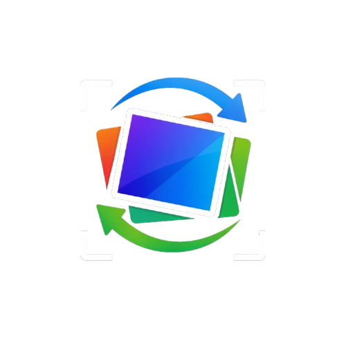
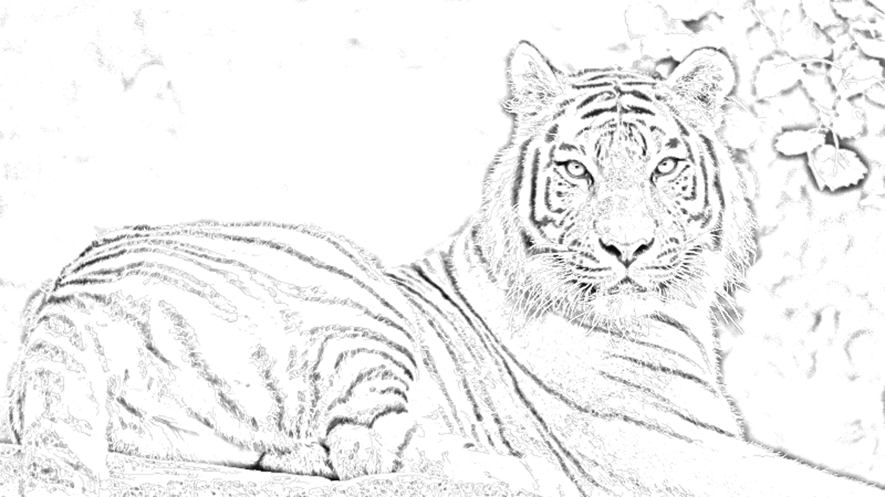

<h1 align="center">Reframe</h1>

<p align="center">
  
</p>

<p align="center">
  <strong>Image Transformation Tool</strong>
</p>

<p align="center">
  <a href="https://python.org">
    
  </a>
  <a href="https://fastapi.tiangolo.com">
    
  </a>
  <a href="https://opencv.org">
    
  </a>
  <a href="https://opensource.org/licenses/MIT">
    
  </a>
</p>

Transform your photos into stunning artistic styles using OpenCV-powered image processing.

## Features

- **Modern Web Interface**: Beautiful editorial-style frontend with refined aesthetics
- **FastAPI Backend**: High-performance REST API
- **Pure OpenCV Processing**: Reliable, fast image transformations
- **Multiple Styles**: Cartoon, Pencil Sketch, Watercolor, and Oil Painting
- **Style Variants**: Multiple variations for each artistic style
- **Responsive Design**: Works perfectly on desktop and mobile devices
- **Download Support**: Save transformed images in high-quality PNG format

## Transformation Styles

1. **Cartoon**: Traditional animated style with bold colors, clean lines, and simplified features
2. **Pencil Sketch**: Hand-drawn appearance with detailed line work, crosshatching, and realistic shading
3. **Watercolor**: Soft, flowing colors with gentle brush strokes and dreamy atmospheric effects
4. **Oil Painting**: Rich, textured brush strokes with vibrant colors and classic painting techniques

## Installation

### Prerequisites

- Python 3.7+

### Setup Steps

1. **Clone the repository**:
   ```bash
   git clone <repository-url>
   cd reframe
   ```

2. **Install dependencies**:
   ```bash
   pip install -r requirements.txt
   ```

3. **Run the application**:
   ```bash
   python main.py
   ```

   Or using uvicorn directly:
   ```bash
   uvicorn main:app --reload --host 0.0.0.0 --port 8000
   ```

4. **Open your browser and navigate to**:
   ```
   http://localhost:8000
   ```

## Requirements

- Python 3.7+
- See `requirements.txt` for Python dependencies

## How It Works

1. **Upload**: Choose an image file (PNG, JPG, JPEG)
2. **Select Style**: Pick from 4 transformation styles
3. **Generate**: Click "Apply" to process with OpenCV
4. **Download**: Save your transformed image

## Technology Stack

- **FastAPI**: High-performance Python web framework
- **OpenCV**: Computer vision and image processing
- **PIL/Pillow**: Image handling and manipulation
- **NumPy**: Numerical computing
- **HTML/CSS/JavaScript**: Modern responsive frontend

## Gallery

Transformation results showcasing the artistic styles available in Reframe:

| Style | Result |
|-------|--------|
| Oil Painting |  |
| Pencil Sketch |  |
| Watercolor |  |

## Project Structure

```
reframe/
├── main.py              # FastAPI application and API routes
├── transform.py         # OpenCV image transformation logic
├── static/
│   ├── index.html      # Main HTML frontend
│   ├── style.css       # CSS styling
│   ├── script.js       # JavaScript frontend logic
│   ├── Reframe.png     # Application icon
│   ├── reframe_*.png   # Gallery images
│   └── *.png           # Hero/floating card images
├── requirements.txt     # Python dependencies
└── README.md          # This file
```

## Performance

- Processing takes only seconds per image
- High-quality output suitable for printing or sharing
- Optimized for both speed and quality

## Troubleshooting

- **Processing errors**: Try with a smaller image or different style
- **Display issues**: Ensure you're using a modern browser with JavaScript enabled

## Contributing

Contributions are welcome. Please feel free to submit a Pull Request.

## License

This project is available under the [MIT License](https://opensource.org/licenses/MIT).
